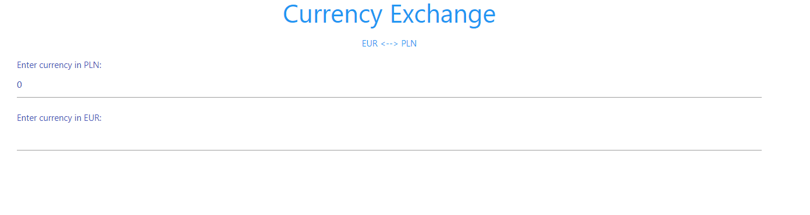

## Currency converter

This is application to convert form PLN to EUR and from EUR to PLN.

Technologies: HTML5, CSS3, React

This project was bootstrapped with [Create React App](https://github.com/facebook/create-react-app).

In the project directory, you can run:

### `npm start`

Additional functionalities that can be implemented:

1. Not static exchange rate - e.g use API
2. Add more currency
